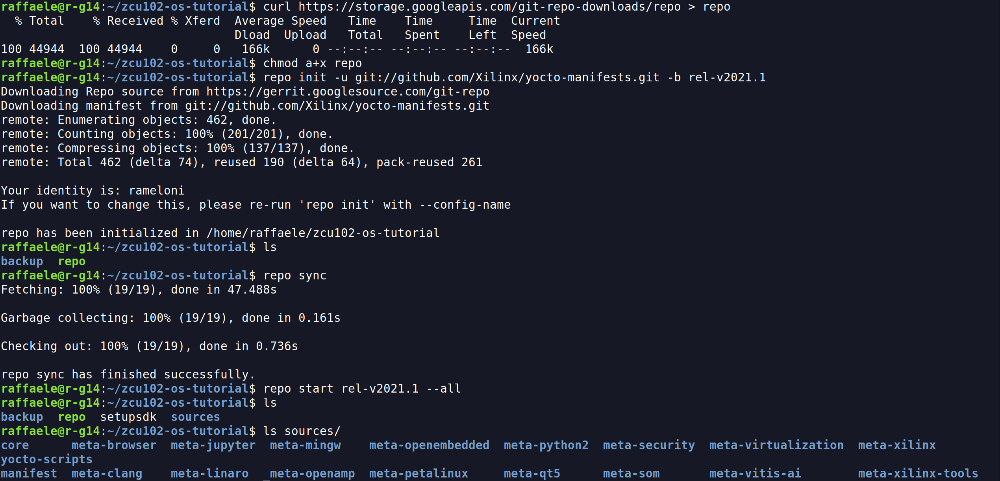
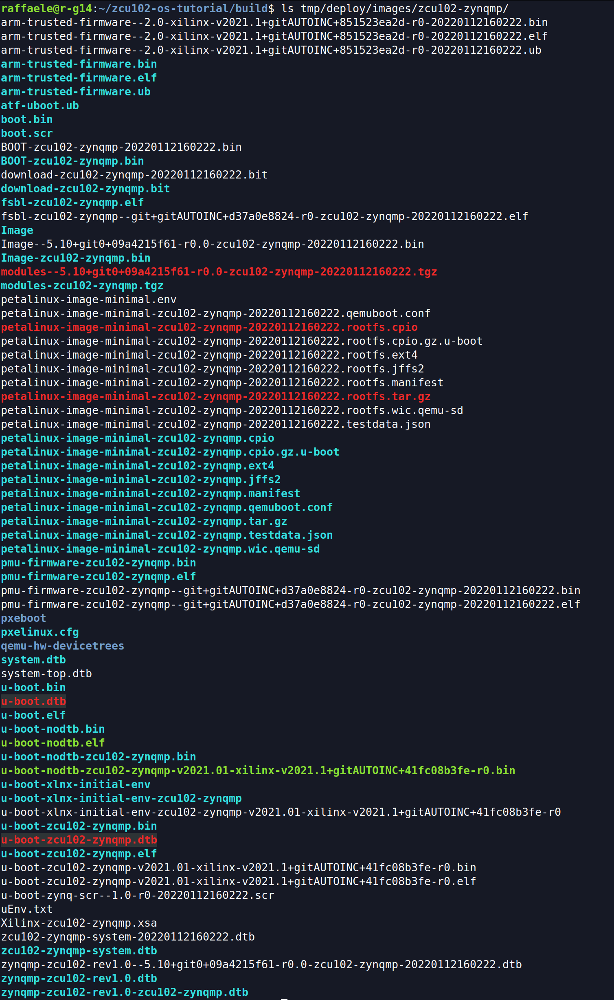
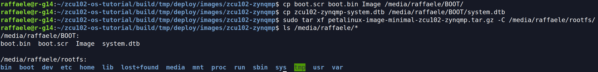
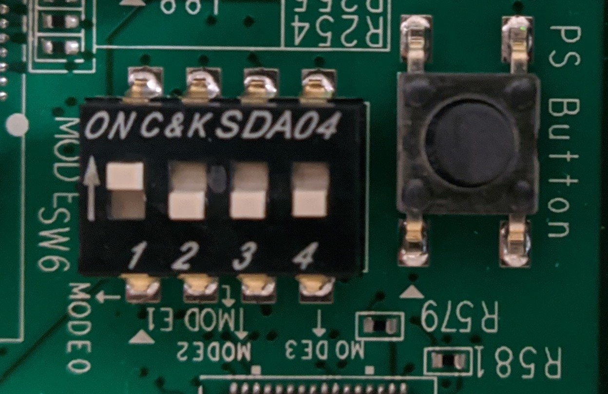
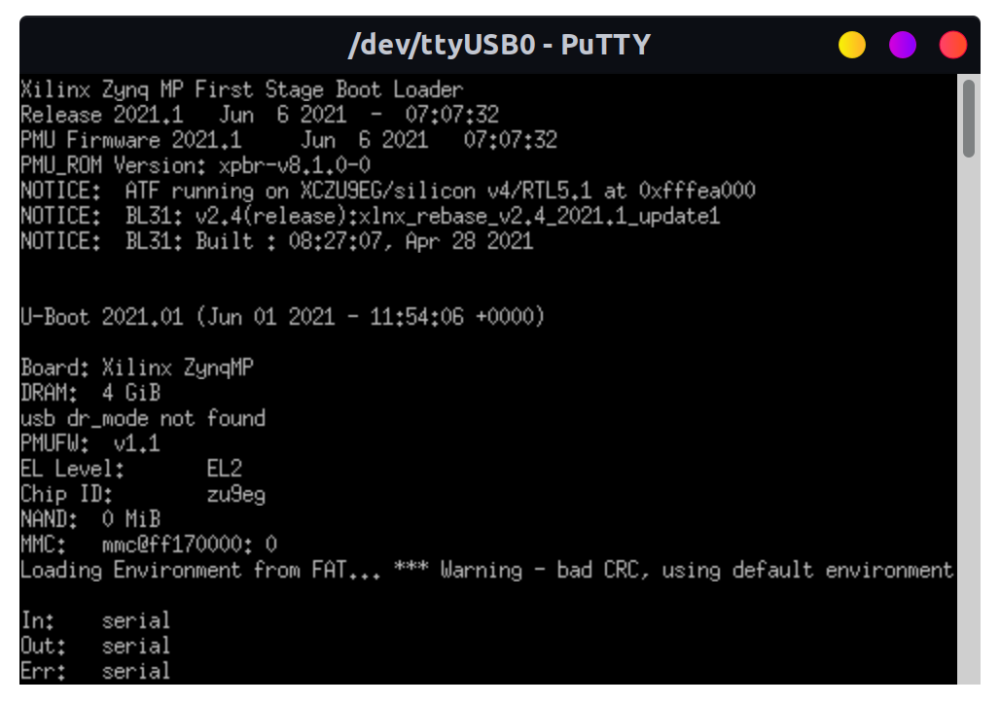
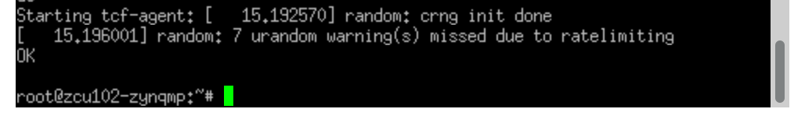

This tutorial is a step-by-step guide which shows how to create a custom Yocto-linux distribution for the <a href="https://www.xilinx.com/products/boards-and-kits/ek-u1-zcu102-g.html" target="_blank">**Xilinx UltraScale+ ZCU102**</a>. The passages have been tested ONLY on the ZCU102, but they should be working also for other Xilinx heterogeneous boards, with CPU and FPGA.

A basic bootable image can be downloaded here: <a href="downloads/linux-yocto-zcu102_rel-v2021.1.tar.gz" class="btn btn--info" style="display: inline-block;">Download Yocto ZCU102</a>

**Last update the 11/05/2022** - Tutorial created by R. Meloni the 13/01/2022

## Contact us
If you encounter any errors which are not in the **[Troubleshooting](#troubleshooting)** section of this page, please open an <a href="https://github.com/mdc-suite/mdc-suite.github.io/issues" target="_blank">issue</a> on GitHub, or send an e-mail to:

    Raffaele Meloni - raffaele.meloni99@gmail.com
    Daniel Madroñal - dmadronalquin@uniss.it


## System Requirements
Please, before starting, make sure you meet the following requirements:
1. A host machine with a Yocto supported <a href="https://docs.yoctoproject.org/3.4/ref-manual/system-requirements.html#supported-linux-distributions" target="_blank">Linux distribution</a>. I've used Ubuntu 20.04 LTS on Asus Rog Zephyrus G14 2021.
2. At least 65GB free space disk on your host machine (the building system requires this free space).
3. A stable Internet connection to fetch repositories and download files. Fast connection is recommended because many errors can be encoutered because of a bad connection.
4. All <a href="https://docs.yoctoproject.org/3.4/ref-manual/system-requirements.html#required-packages-for-the-build-host" target="_blank">required packages</a> installed on the host machine.

Further details at <a href="https://docs.yoctoproject.org/3.4/index.html" target="_blank">Yocto documentation (3.4)</a>


## Build OS instructions
The following steps are needed to port Linux Yocto on the ZCU102.

### Download layers
Create a working directory (e.g ~/bin/ or another), cd into it and install the `repo` script:
```bash
# from your working directory
$ curl https://storage.googleapis.com/git-repo-downloads/repo > repo
$ chmod a+x repo
# test repo
$ repo --help
```

Download and fetch the manifest for required layers. Replace `<release>` with a <a href="https://xilinx-wiki.atlassian.net/wiki/spaces/A/pages/18841883/Yocto" target="_blank">supported release</a>, e.g. `rel-v2021.1` if you have installed Ubuntu 20.04 LTS on the host machine:
```bash
$ repo init -u git://github.com/Xilinx/yocto-manifests.git -b <release>
$ repo sync 
# Checkout the corresponding release for each repository. If you don't it, all repositories will not have the correct release branch
$ repo start <release> --all
```
Repo uses a manifest: an XML file that describes all the required repositories.  It can manage all of your git repositories, so they are synced every time.

Now layers are available on the working directory.



### Configure Yocto
Launch the Yocto Environment:
```bash
# Setupsdk is a wrapper for the familiar "oe-init-build-env" Yocto script. It creates build directory
$ source setupsdk
```

Configure `bblayers.conf` like [bblayers.conf.template](bblayers.conf.template) and edit `local.conf`:
```bash
# Select the correct target machine
MACHINE ?= "zcu102-zynqmp"

# Generate u-boot Boot Script. Append this line
EXTRA_IMAGEDEPENDS_append = "u-boot-zynq-scr"
```


### Launch bitbake
Once Yocto is configured, you can build the OS image running:
```bash
$ bitbake petalinux-image-minimal
```
At the end of the process, image files are available at `./build/tmp/deploy/images/<target-machine>/` and they can be copied on an [SD card](#boot-from-sd-card).

<details>
<summary>Click to see deploy directory content</summary>



</details>


## Additional functionalities
This section provides steps in order to extend the functionalities of the OS, such as allowing the FPGA runtime reconfiguration, adding the software development kit and USB 3.0 support. 
### FPGA runtime reconfiguration support
In order to use the FPGA at runtime from your OS, add this line to `local.conf`:
```bash
EXTRA_IMAGE_FEATURES += "fpga-manager"
```
Please take a look at **[FPGA programming](#fpga-programming)** options.

### SDK tools
In order to use the Software Development Tools (gcc, make, pkgconfig etc.), edit the `EXTRA_IMAGE_FEATURES` variable within `local.conf`:
```bash
EXTRA_IMAGE_FEATURES += "debug-tweaks tools-sdk"
```

### USB support
In order to use the USB port available on the UltraScale, more steps than previous two features are needed. If you want this functionality in your OS, please see the instrucions at this page [Zynq USB Device Drivers](usb-device-driver).


## Boot from SD card
Prepare an SD card creating two partitions, see this <a href="https://subscription.packtpub.com/book/hardware-and-creative/9781785289736/1/ch01lvl1sec12/creating%20partitions%20and%20formatting%20the%20sd%20card" target="_blank">tutorial</a>:
- The **first** one as a **bootable** partition (100MB, FAT16)
- The **second** one for the **rootfs** (EXT4)

Copy boot files in the **first** partition:
```bash
# cd into the deploy images directory
$ cd tmp/deploy/images/zcu102-zynqmp/

$ cp boot.scr boot.bin Image <path-first-partition>
$ cp zcu102-zynqmp-system.dtb <path-first-partition>/system.dtb
```

Extract rootfs tarball into the **second** partition:
```bash
$ sudo tar xf petalinux-image-minimal-zcu102-zynqmp.tar.gz -C <path-sd-second-partition>
```


Then connect the board (UART) to your laptop and check the serial port using `dmesg`.
```bash
$ dmseg | grep tty
# USB is usually connected to ttyUSB*
```

Open a terminal emulation program (e.g. Putty), executed with privileges (`sudo`).


|  UART     | Configuration |
| --------- | ------------: |
| Baud rate | 115200        |
| Data bits | 8             |
| Stop bits | 1             |
| Parity    | None          |
 
Finally set the switches (sw6) in boot SD mode (ON, OFF, OFF, OFF) and turn on the board.

<details>
<summary>Click to see the switches configuration</summary>




</details>
<details>
<summary>Click to see Linux shell for ZCU102</summary>




</details>


## FPGA programming
If you have added the [FPGA support](#fpga-runtime-reconfiguration-support), the **fpgautil** tool will be available on your system. It allows you to load a binary* version of a bitstream at runtime.
```
root@zcu102-zynqmp:~# fpgautil -h
 
fpgautil: FPGA Utility for Loading/reading PL Configuration in zynqMP
 
Usage:  fpgautil -b <bin file path> -o <dtbo file path>
 
Options: -b <binfile>           (Bin file path)
         -o <dtbofile>          (DTBO file path)
         -f <flags>             Optional:

# Useful links
<https://docs.yoctoproject.org/3.4/index.html>

<https://xilinx-wiki.atlassian.net/wiki/spaces/A/pages/18841862/Install+and+Build+with+Xilinx+Yocto> <AES User Key>
          -r <Readback>         Optional: <file name>
                                Default: By default Read back contents will be stored in readback.bin file
          -t                    Optional: <Readback Type>
                                   0 - Configuration Register readback
                                   1 - Configuration Data Frames readback
                                Default: 0 (Configuration register readback)
          -R                    Optional: Remove overlay from a live tree
  
Example:
(Load Bitstream)
fpgautil -b top.bit.bin
```
<div class="note">*vivado provides an option to generate the .bin version of the bitstream </div>

## Troubleshooting
Following this tutorial you can encounter errors due to host packages.
This is a list of solved errors:

1. **package require hsi FAILED**
```
ERROR: pmu-firmware-git+gitAUTOINC+d37a0e8824-r0 do_configure: Execution of '/home/raffaele/bin/build/tmp/work/zcu102_zynqmp-xilinx-linux/pmu-firmware/git+gitAUTOINC+d37a0e8824-r0/temp/run.do_configure.1520032' failed with exit code 1:
MISC_ARG is  -yamlconf /home/raffaele/bin/build/tmp/work/zcu102_zynqmp-xilinx-linux/pmu-firmware/git+gitAUTOINC+d37a0e8824-r0/pmu-firmware.yaml
APP_ARG is  -app "ZynqMP PMU Firmware"
Using xsct from: /home/raffaele/bin/build/xsct/Vitis/2021.1/bin/xsct
cmd is: xsct -sdx -nodisp 
......
......
package require hsi FAILED:
invalid command name "hsi::create_dt_node"
    while executing
"hsi::create_dt_node -help"
    (in namespace eval "::hsi::help" script line 6)
    invoked from within
"namespace eval ::hsi::help {
    variable version 0.1
    ::xsdb::setcmdmeta {hsi create_dt_node} categories {hsi}
    ::xsdb::setcmdmeta {hsi create..."
    (file "/home/raffaele/bin/build/xsct/Vitis/2021.1/scripts/xsct/hsi/hsihelp.tcl" line 25)
    invoked from within
"source /home/raffaele/bin/build/xsct/Vitis/2021.1/scripts/xsct/hsi/hsihelp.tcl"
    ("package ifneeded hsi::help 0.1" script)WARNING: exit code 1 from a shell command.
......
......
```

    <span style="color: green">**Solution**</span>: install `libtinfo5`. 
    
    **Related issue:** [https://github.com/Xilinx/meta-xilinx-tools/issues/19](https://github.com/Xilinx/meta-xilinx-tools/issues/19).

2. **configure: error: raw selected, but required raw.h header file not available**
```
    ERROR: util-linux-native-2.36-r0 do_configure: configure failed
    ERROR: util-linux-native-2.36-r0 do_configure: Execution of '/home/raffaele/zcu102-os-tutorial/build/tmp/work/x86_64-linux/util-linux-native/2.36-r0/temp/run.do_configure.350741' failed with exit code 1:
    automake (GNU automake) 1.16.2
    Copyright (C) 2020 Free Software Foundation, Inc.
    License GPLv2+: GNU GPL version 2 or later <https://gnu.org/licenses/gpl-2.0.html>
    This is free software: you are free to change and redistribute it.
    There is NO WARRANTY, to the extent permitted by law.

    Written by Tom Tromey <tromey@redhat.com> 
        and Alexandre Duret-Lutz <adl@gnu.thisorg>.
    AUTOV is 1.16
    autoreconf: Entering directory .
    ......
    ......
    ......
    | checking for syscall prlimit64... SYS_prlimit64
    | checking for prlimit... yes
    | checking for syscall pivot_root... SYS_pivot_root
    | configure: error: raw selected, but required raw.h header file not available
    | WARNING: exit code 1 from a shell command.
    | 
    ERROR: Task (virtual:native:/home/raffaele/zcu102-os-tutorial/sources/core/meta/recipes-core/util-linux/util-linux_2.36.bb:do_configure) failed with exit code '1'
    NOTE: Tasks Summary: Attempted 1010 tasks of which 0 didn't need to be rerun and 1 failed.
    NOTE: Writing buildhistory
    NOTE: Writing buildhistory took: 4 seconds

    Summary: 1 task failed:
    virtual:native:/home/raffaele/zcu102-os-tutorial/sources/core/meta/recipes-core/util-linux/util-linux_2.36.bb:do_configure
    Summary: There were 4 WARNING messages shown.
    Summary: There were 2 ERROR messages shown, returning a non-zero exit code.
```
    In recent linux kernel raw.h file was removed.
    
    <span style="color: green">**Solution**</span>: append this line in your `conf/local.conf` (<font color="green">preferred</font>)
    ```bash 
    # Fix configure: error: raw selected, but required raw.h header file not available for new host kernels
    EXTRA_OECONF_remove = "--enable-raw"
    ```
    or remove directly `--enable-row` from EXTRA_OECONF in `./sources/core/meta/recipes-core/util-linux/util-linux_2.36.bb`. 
    
    **Related issue:** [fix enable raw](https://lists.yoctoproject.org/g/yocto/topic/util_linux_and_enable_raw/86266370?p=,,,20,0,0,0::recentpostdate/sticky,,,20,2,0,86266370,previd=1634094655266752289,nextid=1633973089717825518&previd=1634094655266752289&nextid=1633973089717825518).

*This list will be updated over time.*

