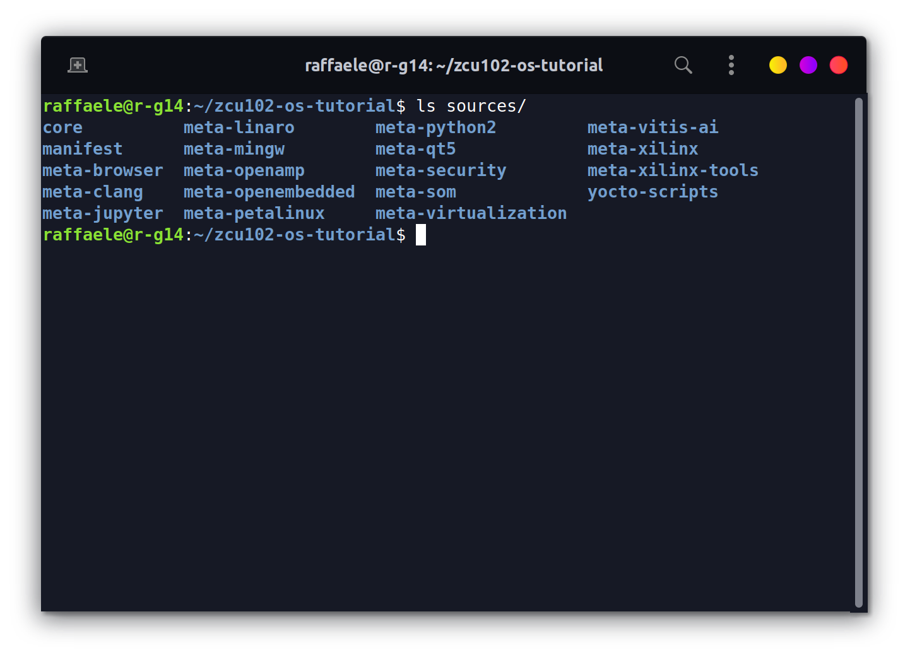

This tutorial is a step-by-step guide to create a custom Yocto-linux distribution for the **Xilinx UltraScale+ ZCU102**. The tutorial should be working for the others Xilinx heterogeneous boards, with CPU and FPGA.

Page index:
- [System Requirements](#system-requirements)
- [Build OS instructions](#build-os-instructions)
- [Boot from SD card](#boot-from-sd-card)
- [FPGA programming](#fpga-programming)
- [Possible errors](#possible-errors)

## System Requirements
Please, before starting, make sure you meet the following requirements:
1. A host machine with a Yocto supported [Linux distribution](https://docs.yoctoproject.org/3.4/ref-manual/system-requirements.html#supported-linux-distributions). I've used Ubuntu 20.04 LTS on Asus Rog Zephyrus G14 2021;
2. At least 40-50GB free space disk on your host machine;
3. Stable Internet connection to fetch repositories and download files. *Fast connection is recommended because many errors can be encoutered because of a bad connection*;
4. All [required packages](https://docs.yoctoproject.org/3.4/ref-manual/system-requirements.html#required-packages-for-the-build-host) installed.

Yocto documentation (3.4): <https://docs.yoctoproject.org/3.4/index.html>


## Build OS instructions
The following instructions are necessary to port Linux Yocto on the ZCU102.

### Download layers
Create a working directory (e.g ~/bin/ or another), cd into it and install the `repo` script:
```bash
$ curl https://storage.googleapis.com/git-repo-downloads/repo > repo
$ chmod a+x repo
$ repo --help
```

Download and fetch the manifest for required layers. Replace `<release>` with a [supported release](https://xilinx-wiki.atlassian.net/wiki/spaces/A/pages/18841883/Yocto), `rel-v2021.1` if you have installed Ubuntu 20.04 LTS:
```bash
$ repo init -u git://github.com/Xilinx/yocto-manifests.git -b <release>
$ repo sync 
# Checkout the corresponding release for each repository. If you don't it, all repositories will not have the correct release branch
$ repo start <release> --all
```
*Repo uses a manifest which is an XML file that describes all the required repositories.  It can manage all of your git repositories so they remain in sync.*

Now layers are available on your working directory



### Configure Yocto
Launch the Yocto Environment:
```bash
# Setupsdk is a wrapper for the familiar "oe-init-build-env" Yocto script. It creates build directory
$ source setupsdk
```

Configure `bblayers.conf` like [bblayers.conf.template](bblayers.conf.template).

Edit `local.conf`:
```bash
# Select the correct target machine
MACHINE ?= "zcu102-zynqmp"

# Generate u-boot Boot Script. Append this line
EXTRA_IMAGEDEPENDS_append = "u-boot-zynq-scr"
```


### FPGA support (optional)
If you want to use the FPGA at runtime from your OS, add this line to `local.conf`:
```bash
EXTRA_IMAGE_FEATURES += "fpga-manager"
```

### Launch bitbake
Once Yocto is configured you can build the OS image running:
```bash
$ bitbake petalinux-image-minimal
```
At the end of the process, image files are available at `./build/tmp/deploy/images/zcu102-zynqmp/`.
If you included `fpga-manager` in your image, go to **[FPGA programming](#fpga-programming)** to see how to use it.


## Boot from SD card
Prepare an SD card creating two partitions:
- The **first** one as a **bootable** partition (100MB FAT16)
- The **second** one for the **rootfs** (EXT4)

Copy boot files in the **first** partition:
```bash
# cd into the deploy images directory
$ cd tmp/deploy/images/zcu102-zynqmp/

$ cp boot.scr boot.bin Image <path-first-partition>
$ cp zcu102-zynqmp-system.dtb <path-first-partition>/system.dtb
```

Extract rootfs tarball into the **second** partition.
```bash
$ tar xf petalinux-image-minimal-zcu102-zynqmp.tar.gz -C <path-sd-second-partition>
```
Then use a terminal emulation program (e.g. Putty), executed with privileges (sudo), to connect the board through the serial port. To do so, first the name of the serial port should be checked using `dmesg`.

**Aggiungere immagine**

| UART Configuration|
| --- | --- |
| Baud rate | 115200 |
| Data bits | 8 |
| Stop bits | 1 |
| Parity | None |
 
Once the board is turned on, a Linux shell will be prompted.


## FPGA programming
If you add **[FPGA support](#fpga-support-optional)** the tool `fpgautil` is available on your system. It allows you to load a binary version of a bitstream at runtime, see **[Convert bitstream to binary](bitstream-to-binary)**.
```
root@zcu102-zynqmp:~# fpgautil -h
 
fpgautil: FPGA Utility for Loading/reading PL Configuration in zynqMP
 
Usage:  fpgautil -b <bin file path> -o <dtbo file path>
 
Options: -b <binfile>           (Bin file path)
         -o <dtbofile>          (DTBO file path)
         -f <flags>             Optional: <Bitstream type flags>
                                   f := <Full | Partial >
                                Defaults: <Full>
          -s <secure flags>     Optional: <Secure flags>
                                   s := <AuthDDR | AuthOCM | EnUsrKey | EnDevKey | AuthEnUsrKeyDDR | AuthEnUsrK>
          -k <AesKey>           Optional: <AES User Key>
          -r <Readback>         Optional: <file name>
                                Default: By default Read back contents will be stored in readback.bin file
          -t                    Optional: <Readback Type>
                                   0 - Configuration Register readback
                                   1 - Configuration Data Frames readback
                                Default: 0 (Configuration register readback)
          -R                    Optional: Remove overlay from a live tree
  
Example:
(Load Bitstream)
fpgautil -b top.bit.bin
```

See documentation at <https://xilinx-wiki.atlassian.net/wiki/spaces/A/pages/18841847/Solution+ZynqMP+PL+Programming>.

### Example of usage
In this example, which shows how `fpgautil` runs, a hardware block created by Vivado ML Enterprise edition, is used.

**Inserire GIF/Video di scheda più terminale**

## Possible errors
Following this tutorial you can encounter errors due to host packages. If you encounter an error which isn't in this section, please, 
I encountered and solved the following errors:

1. **package require hsi FAILED**
    ```
ERROR: pmu-firmware-git+gitAUTOINC+d37a0e8824-r0 do_configure: Execution of '/home/raffaele/bin/build/tmp/work/zcu102_zynqmp-xilinx-linux/pmu-firmware/git+gitAUTOINC+d37a0e8824-r0/temp/run.do_configure.1520032' failed with exit code 1:
MISC_ARG is  -yamlconf /home/raffaele/bin/build/tmp/work/zcu102_zynqmp-xilinx-linux/pmu-firmware/git+gitAUTOINC+d37a0e8824-r0/pmu-firmware.yaml
APP_ARG is  -app "ZynqMP PMU Firmware"
Using xsct from: /home/raffaele/bin/build/xsct/Vitis/2021.1/bin/xsct
cmd is: xsct -sdx -nodisp 
......
......
package require hsi FAILED:
invalid command name "hsi::create_dt_node"
    while executing
"hsi::create_dt_node -help"
    (in namespace eval "::hsi::help" script line 6)
    invoked from within
"namespace eval ::hsi::help {
    variable version 0.1
    ::xsdb::setcmdmeta {hsi create_dt_node} categories {hsi}
    ::xsdb::setcmdmeta {hsi create..."
    (file "/home/raffaele/bin/build/xsct/Vitis/2021.1/scripts/xsct/hsi/hsihelp.tcl" line 25)
    invoked from within
"source /home/raffaele/bin/build/xsct/Vitis/2021.1/scripts/xsct/hsi/hsihelp.tcl"
    ("package ifneeded hsi::help 0.1" script)WARNING: exit code 1 from a shell command.
......
......
    ```
    **Solution:** install `libtinfo5`. Related issue [https://github.com/Xilinx/meta-xilinx-tools/issues/19](https://github.com/Xilinx/meta-xilinx-tools/issues/19).

2. **raw.h**

*This list of possible errors will be updated over time.*


# Mantainers

    Raffaele Meloni - rameloni1@gmail.com

# Useful links
<https://docs.yoctoproject.org/3.4/index.html>

<https://xilinx-wiki.atlassian.net/wiki/spaces/A/pages/18841862/Install+and+Build+with+Xilinx+Yocto>