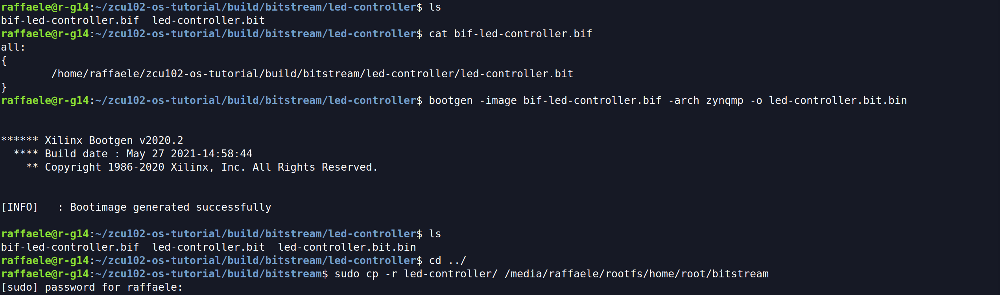

If you want to load a bitstream at runtime from your OS, using `fpgautil`, you can generate a binary version directly from Vivado but if you want yo can convert the bit version into a binary one using `bootgen`.


**Last update the 25/03/2022** - Tutorial created by R. Meloni the 13/01/2022

## Contact us
If you encounter errors or if you have any doubts, please open an <a href="https://github.com/mdc-suite/mdc-suite.github.io/issues" target="_blank">issue</a> on GitHub, or send an e-mail to:

    Raffaele Meloni - raffaele.meloni99@gmail.com


## Generate binary with bootgen
Install `bootgen`, the tool that lets to stitch binary files together and generate device boot images:
```bash
$ sudo apt-get install bootgen-xlnx
    
# How to use it
$ bootgen --help
```

Create a directory into `build/` for your bitstreams:
```bash
$ mkdir build/bitstream/<project-name>
$ cd build/bitstream/<project-name>

# copy into this directory your bitstream
```

Create a `<bif-file>.bif` with this content:
```
# <bif-file>.bif content
all:
{
    <absolute-path-to-bitstream-file>
}
```
The execute `bootgen`:
```bash
# Generate a binary file from bitstream (<arch-family> = zynqmp for zynqmp family as zcu102)
$ bootgen -image <bif-file>.bif -arch <arch-family> -o <bitname>.bit.bin -w on
```

Now `<bitname>.bit.bin` is available into the work directory, it can be copied into the SD card and loaded through `fpgautil`.


