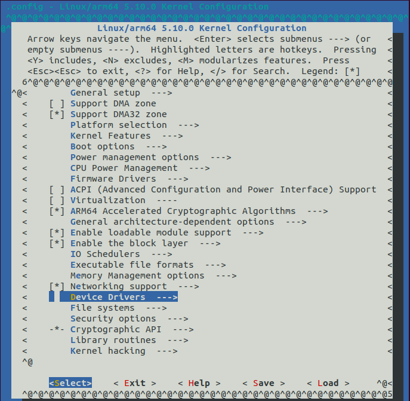
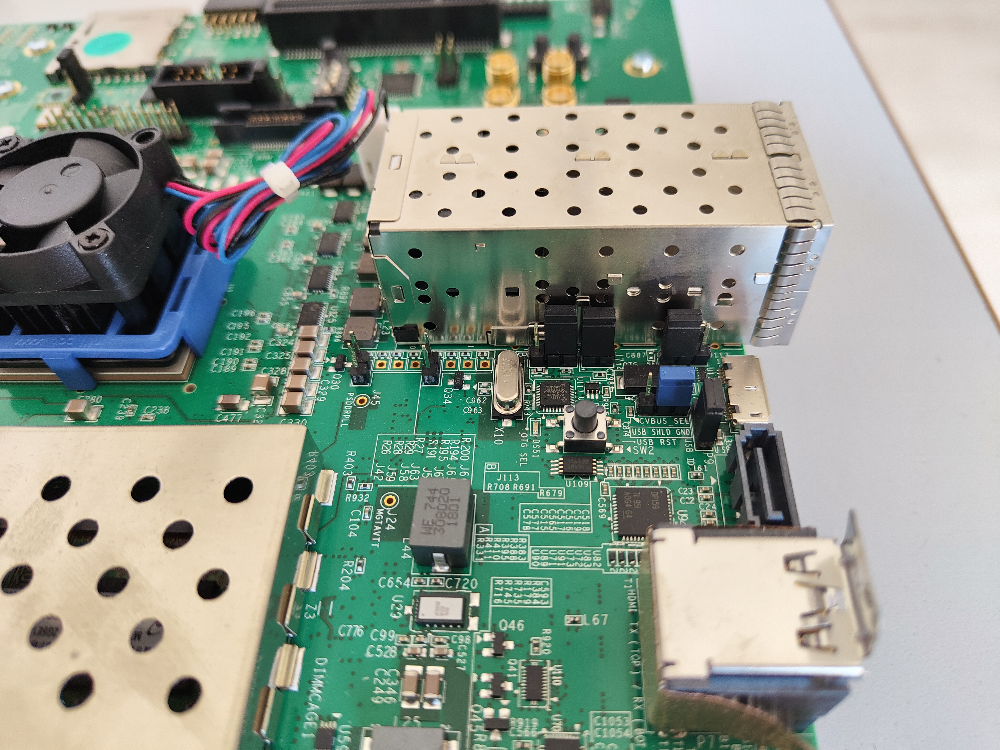

The Zynq Linux USB Device Driver has to be installed in order to connect external peripherals to USB2/3 port, such as storage devices and webcams. The USB controller is capable of fulfilling a wide range of applications for USB 2.0 implementations as a host, device, or On-the-Go (OTG). 

For more informartion about the driver and the other modes, visiting <a href="https://xilinx-wiki.atlassian.net/wiki/spaces/A/pages/18842272/Zynq+Linux+USB+Device+Driver" target="_blank">Xilinx wiki</a> page is recommended.

**Last update the 11/05/2022** - Tutorial created by R. Meloni the 11/05/2022

## Contact us
If you encounter errors or if you have any doubts, please open an <a href="https://github.com/mdc-suite/mdc-suite.github.io/issues" target="_blank">issue</a> on GitHub, or send an e-mail to:

    Raffaele Meloni - raffaele.meloni99@gmail.com


## Host Mode
This mode enables the connection of external devices. In order to install **USB host drivers** follow the steps below:
 1. [Configure the Kernel](#kernel-configuration)
 2. [Create a custom device tree entry](#device-tree)
 3. [Create a custom layer](#create-custom-layer)
 4. [Edit local.conf](#edit-buildconflocalconf)
 5. [Launch bitbake](yoctofpga#launch-bitbake)

### Kernel Configuration
Launch the kernel menuconfig:
```bash
# launch Yocto environment from the working directory
$ source setupsdk

# launch the menuconfig
$ bitbake -c menuconfig virtual/kernel
```

Once the kernel menuconfig has been started and the menu will be displayed. Enable the following config parameters.
```
Device Drivers --->
    [*] USB support --->
          <*> USB ULPI PHY interface support 
          <*> Support for Host-side USB
          <*> EHCI HCD (USB 2.0) support
          <*> USB Mass Storage support
          <*> ChipIdea Highspeed Dual Role Controller
          [*] ChipIdea host controller
              USB Physical Layer drivers --->
              <*> Generic ULPI Transceiver Driver
```
<details> <summary>Click to see the Kernel Configuration menu</summary>



</details>


### Device Tree
Once the kernel has been configured, adding USB entries to the device tree is the next step. The kernel uses the device tree in order to identify the hardware correctly, without this change the USB port is not exploitable.

In order to extend the device tree, create a `system-user.dtsi` file copying the following lines. For more information about the device tree syntax and customization, please visit <a href="https://developer.toradex.com/linux-bsp/how-to/device-tree/device-tree-customization/" target="_blank">device tree customization</a>.
```bash
/ {
        usb_0: usb@e0002000 {
         compatible = "xlnx,zynq-usb-2.20.a", "chipidea,usb2";
         clocks = <&zynqmp_clk 28>;
         dr_mode = "host";
         interrupt-parent = <&gic>;
         interrupts = <0 21 4>;
         reg = <0xe0002000 0x1000>;
         usb-phy = <&usb_phy0>;
     };
 
        usb_phy0: phy0 {
            compatible = "ulpi-phy";
            #phy-cells = <0>;
        reg = <0xe0002000 0x1000>;
        view-port = <0x170>;
        drv-vbus;
        };
};
```

### Create custom layer
Before re-building the image, you need to add a new layer in order to apply the changes and <a href="https://xilinx-wiki.atlassian.net/wiki/spaces/A/pages/61669922/Customizing+Device+Trees+in+Xilinx+Yocto" target="_blank">customize the device tree</a>. From worinkg directory run the following commands:
```bash
# create a custom layer
$ bitbake-layers create-layer <path-to-custom-layers-dir>/meta-user

# add layer to bblayers.conf
$ bitbake-layers add-layer <path-to-custom-layers-dir>/meta-user
```
Create a new recipe, so that device tree will be extended, and copy the `system-user.dtsi`:
```bash
$ cd <path-to-custom-layers-dir>/meta-user
# create new recipes
$ mkdir -p recipes-usb/device-tree/files

# copy the custom device tree inside files dir
$ cp <path-to-system-user.dtsi>/system-user.dtsi recipes-usb/device-tree/files

# create device-tree.bbappend
$ echo "" > recipes-usb/device-tree/device-tree.bbappend
```
Add the following content to `device-tree.bbappend`.
```bash
FILESEXTRAPATHS_prepend := "${THISDIR}/files:"
 
SYSTEM_USER_DTSI ?= "system-user.dtsi"
 
SRC_URI_append = " file://${SYSTEM_USER_DTSI}"

YAML_DT_BOARD_FLAGS_local = "{BOARD zcu102-rev1.0}"
 
do_configure_append() {
        cp ${WORKDIR}/${SYSTEM_USER_DTSI} ${B}/device-tree
        echo "/include/ \"${SYSTEM_USER_DTSI}\"" >> ${B}/device-tree/system-top.dts
}
```

### Edit build/conf/local.conf
Editing `local.conf` is the last step you need before launching the building system again. Copy and paste the following lines:
```bash
# custom device tree
SYSTEM_USER_DTSI = "system-user.dtsi"

# add existing bsp
YAML_DT_BOARD_FLAGS = "{BOARD zcu102-rev1.0}"

# use meta-virtualization layer
DISTRO_FEATURES_append = " virtualization"
```

Finally launch bitbake:
```bash
$ bitbake petalinux-image-minimal
```
### Check the device tree
After the building process has been completed, image files are available at `tmp/deploy/images/zcu102-zynqmp/` directory. From this directory you can run `dtc` in order to extract the source code from device-tree-blob.
```bash 
$ dtc -I dtb -O dts -o system-dev-tree.dts zynqmp-zcu102-rev1.0.dtb
```
Now you can assess that all changes has been applied. 


## Test peripherals connection
Once the image with the USB driver is [installed on an SD card](yoctofpga#boot-from-sd-card), you should set jumpers in order to enable the host connection.

|  Jumper  | Mode |
| :------: | :--: |
| J7       | ON   |
| J110     | 2-3  |
| J113     | 1-2  |

<details> <summary>Display Jumpers</summary>



</details>

In order to check usb-devices run from the UltraScale command line:
```bash
root@zcu102@-zynqmp:~# lsusb
```